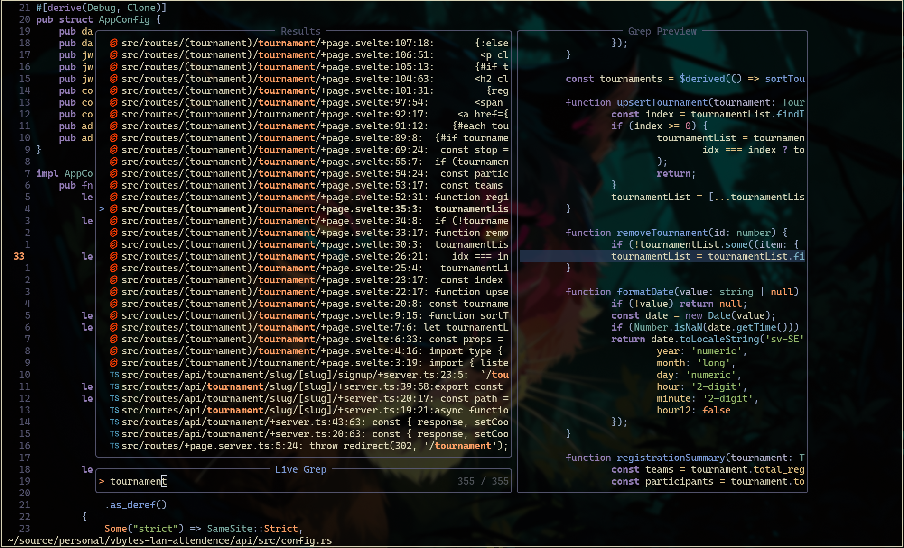
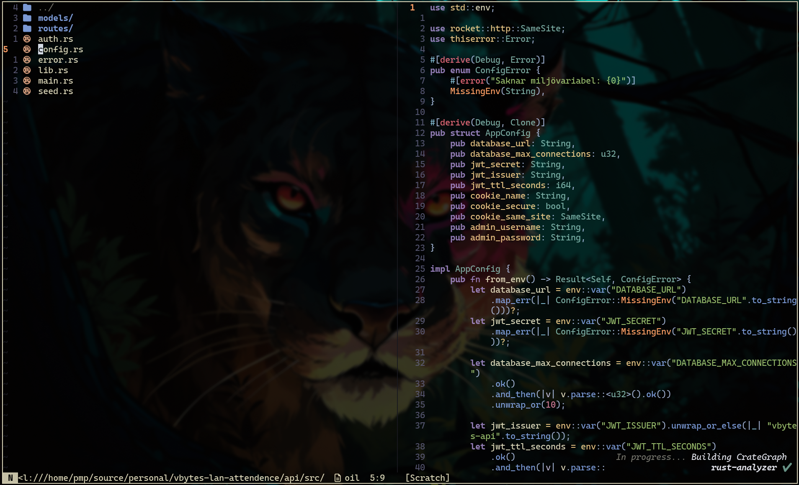
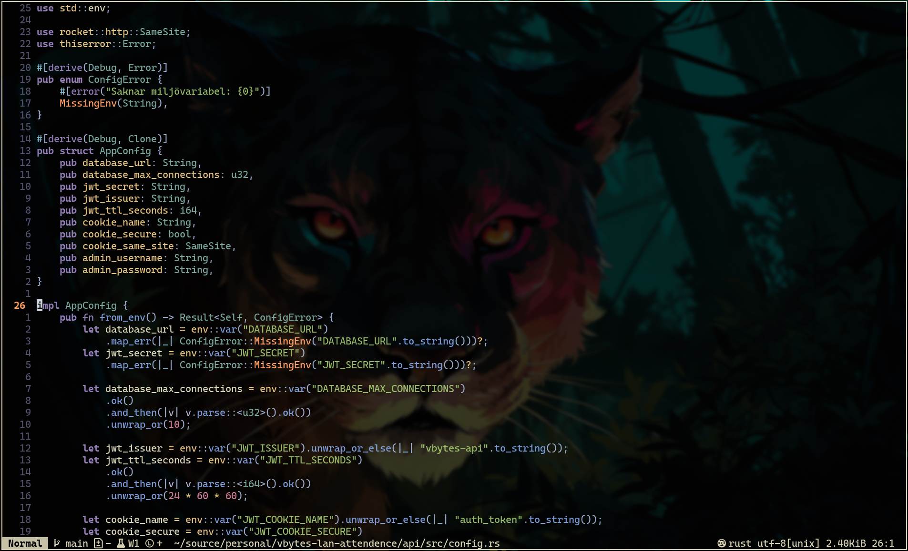
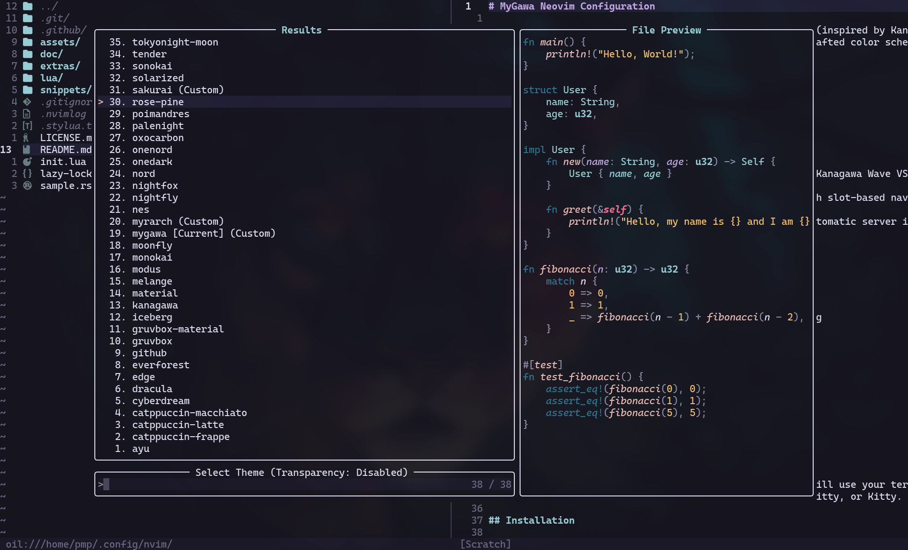

# MyGawa Neovim Configuration

A custom Neovim configuration featuring the MyGawa theme (inspired by Kanagawa Wave) with transparent backgrounds and carefully crafted color schemes.

## Screenshots






## Features

- **Custom MyGawa Theme**: A custom colorscheme based on Kanagawa Wave VSCode theme with full transparency
- **Session Management**: Advanced session management with slot-based navigation
- **LSP Integration**: Full LSP support with Mason for automatic server installation
- **Telescope**: Fuzzy finder for files, grep, and more
- **Harpoon**: Quick file navigation
- **GitUI Integration**: Matching theme for GitUI
- **Treesitter**: Advanced syntax highlighting
- **Completion**: nvim-cmp with snippet support
- **Formatting & Linting**: Conform.nvim and nvim-lint
- **File Explorer**: Oil.nvim for buffer-like file editing
- **Kulala**: HTTP client for REST API testing

## Requirements

- Neovim >= 0.11.0
- Git
- npm
- dotnet-sdk
- unzip
- ripgrep
- codespell
- A Nerd Font (optional, but recommended)

**Note:** The theme uses transparent backgrounds, so it will use your terminal's background. Recommended terminals: Ghostty, Alacritty, or Kitty.

## Installation

### Linux & Mac
```bash
git clone https://github.com/sebastians-codes/nvim.git "${XDG_CONFIG_HOME:-$HOME/.config}"/nvim
```

### Windows PowerShell
```powershell
git clone https://github.com/sebastians-codes/nvim.git "${env:LOCALAPPDATA}\nvim"
```

### Windows CMD
```cmd
git clone https://github.com/sebastians-codes/nvim.git "%localappdata%\nvim"
```

### Post Installation
Start Neovim:
```bash
nvim
```

Lazy.nvim will automatically install all plugins on first launch.

## Theme

The configuration includes over 30+ themes, including a custom MyGawa theme with:
- Transparent backgrounds throughout
- Kanagawa Wave-inspired colors
- Matching GitUI theme and keybindings available in `extras/`

To use the GitUI theme and keybindings:
```bash
cp ~/.config/nvim/extras/gitui-theme.ron ~/.config/gitui/theme.ron
cp ~/.config/nvim/extras/gitui-keybindings.ron ~/.config/gitui/key_bindings.ron
```

To use the Kanagawa transparent theme for OpenCode:
```bash
cp ~/.config/nvim/extras/kanagawa-transparent.json ~/.config/opencode/themes/kanagawa-transparent.json
```

### Colors

- Background: Transparent
- Foreground: `#DCD7BA`
- Comments: `#727169`
- Strings: `#98BB6C`
- Functions: `#7E9CD8`
- Keywords: `#957FB8`
- Numbers: `#D27E99`
- Constants: `#FFA066`

## Key Plugins

- **lazy.nvim**: Plugin manager
- **telescope.nvim**: Fuzzy finder
- **nvim-lspconfig**: LSP configuration
- **nvim-treesitter**: Syntax parsing
- **harpoon**: File navigation
- **oil.nvim**: File explorer
- **mini.nvim**: Collection of minimal modules (sessions, statusline, etc.)
- **gitsigns.nvim**: Git integration

## Key Bindings

### General
- `<leader>w`: Save file
- `<leader>gg`: gitui

### Session Management
- `ss`: Open session manager
- `se`: Assign session to slot
- `s1-s9, s0`: Load session from slot (s0 = slot 10)
- `sq`: Save session and quit
- Sessions can also be started from command line: `nvim 1` (starts session in slot 1)

### Tab Management
- `tn`: Open new tab with parent directory
- `tx`: Close current tab
- `tt`: Open new tab with terminal
- `t1-t9`: Go to tab 1-9

### Window Navigation
- `<C-h>`: Move to left window
- `<C-l>`: Move to right window
- `<C-j>`: Move to lower window
- `<C-k>`: Move to upper window

### File Management
- `<leader>pv`: Open parent directory
- `<leader>nf`: Create new file
- `<leader>nd`: Create new directory

### Diagnostics
- `<leader>qq`: Open quickfix list with diagnostics
- `<leader>qe`: Show diagnostic error in float
- `<leader>qa`: Show all diagnostics (Telescope)
- `<leader>qr`: Run project-wide diagnostics

### Editing
- `Alt+j`: Move line/selection down
- `Alt+k`: Move line/selection up
- `<leader>cc`: Comment/uncomment line or selection
- Auto-closing brackets: `(`, `[`, `{`, `"`, `'`

### Terminal
- `<Esc><Esc>`: Exit terminal mode

### Theme
- `<leader>tt`: Open theme picker
- `<leader>ts`: Toggle transparency

### Telescope (Fuzzy Finder)
- `<leader>sh`: Search help
- `<leader>sk`: Search keymaps
- `<leader>sf`: Search files
- `<leader>ss`: Search select Telescope
- `<leader>sw`: Search current word
- `<leader>sg`: Search by grep
- `<leader>sd`: Search diagnostics
- `<leader>sr`: Resume last search
- `<leader>s.`: Search recent files
- `<leader><leader>`: Find existing buffers
- `<leader>/`: Fuzzy search in current buffer
- `<leader>s/`: Search in open files
- `<leader>sn`: Search Neovim config files

### Harpoon (File Navigation)
- `<leader>A`: Add file to harpoon
- `<leader>a`: Open harpoon menu
- `<leader>1-5`: Select harpoon file 1-5
- `<leader>z`: Open harpoon in telescope
- `<C-S-P>`: Previous harpoon file
- `<C-S-N>`: Next harpoon file

### LSP
- `gd`: Go to definition
- `gr`: Go to references
- `gI`: Go to implementation
- `gD`: Go to declaration
- `<leader>D`: Type definition
- `<leader>ds`: Document symbols
- `<leader>ws`: Workspace symbols
- `<leader>rn`: Rename symbol
- `<leader>ca`: Code action
- `<leader>th`: Toggle inlay hints
- `K`: Hover documentation

### Formatting
- `<leader>f`: Format buffer
- `<leader>cf`: Run codespell on current file

## Configuration Structure

```
~/.config/nvim/
├── init.lua                 # Entry point
├── lua/
│   ├── config/              # Core configuration
│   │   ├── autocmds.lua
│   │   ├── keymaps.lua
│   │   ├── lazy.lua
│   │   ├── oil.lua
│   │   ├── options.lua
│   │   ├── project-diagnostics.lua
│   │   ├── session_manager.lua
│   │   └── startup_sessions.lua
│   ├── plugins/             # Plugin configurations
│   │   ├── core.lua
│   │   ├── lsp.lua
│   │   ├── telescope.lua
│   │   ├── theme.lua
│   │   └── ... (30+ plugin configs)
│   ├── themes/              # Theme configurations
│   │   ├── manager.lua      # Theme manager
│   │   └── ... (30+ theme files)
│   └── snippets/            # Custom snippets
│       ├── cs.lua
│       ├── go.lua
│       ├── javascriptreact.lua
│       ├── rust.lua
│       ├── svelte.lua
│       └── typescriptreact.lua
├── snippets/                # Symlink to lua/snippets/
├── assets/                  # Screenshots
├── doc/                     # Documentation
├── extras/                  # Extra configs (GitUI theme)
└── README.md
```

## License

MIT
